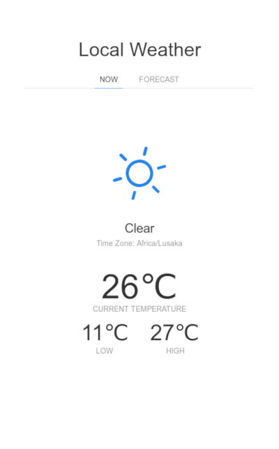
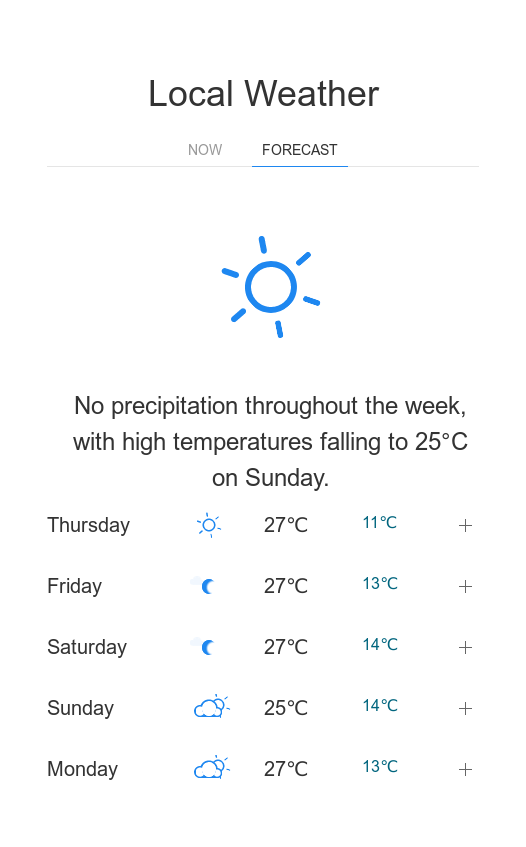
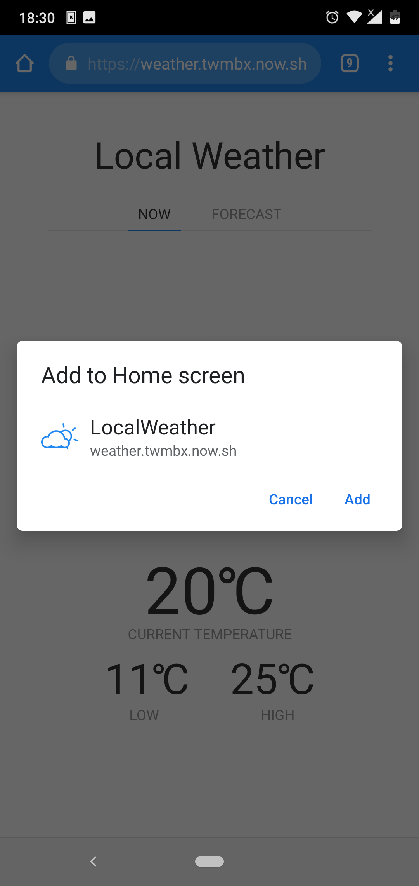

# Local Weather

A progressive web application that shows your current weather plus a five day forcast. This application depends on a backend that provides it with data from the [DarkSky API](https://darksky.net/dev).

```bash
yarn
yarn run dev
```

Open up [localhost:3000](http://localhost:3000) and start clicking around.

# Built using the following:

- [Svelte](https://svelte.dev) 
- [Sapper](https://sapper.svelte.dev) 
- [UI Kit](https://getuikit.com/docs/card) 
- Modified [Animated Weather Icons](https://codepen.io/joshbader/pen/EjXgqr)  by [Joshua Bader](https://joshuabader.com/)

## Demo

[weather.twmbx.now.sh](https://weather.twmbx.now.sh)

## Screenshots



